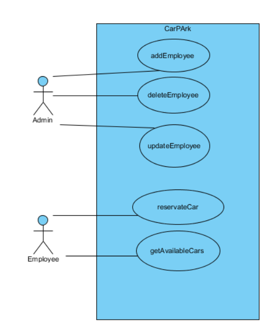
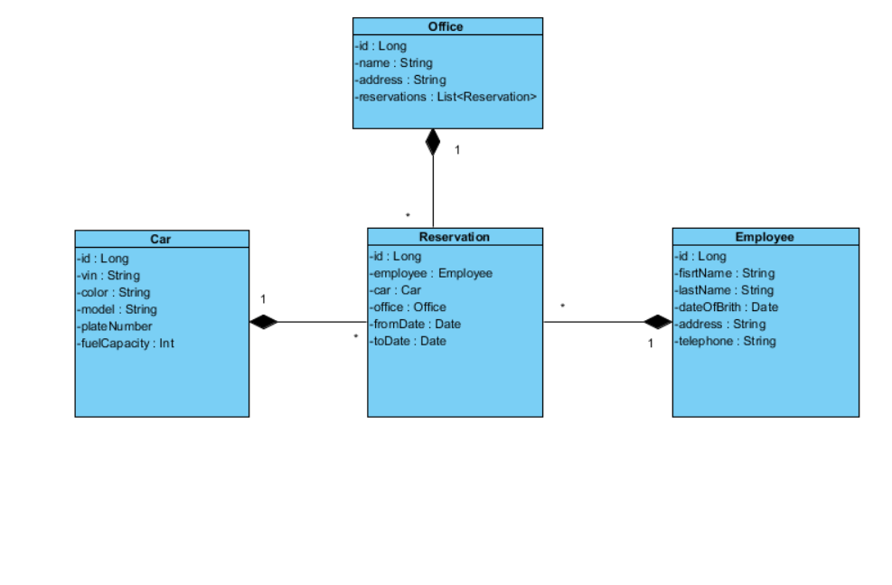

# PA165---CarPark
PA165 project

Task: The project should emulate a real situation in a company. The company employees can apply for rental of a car. The rental is applied to a given date. Based on such application, the system will offer list of free cars and the system allows reservation of a car.

The project is developed in PA165 course on Faculty of Informatics at Masaryk University. 

Authors:
Jan Hellar
Jan Starka
Marek Mihalech

